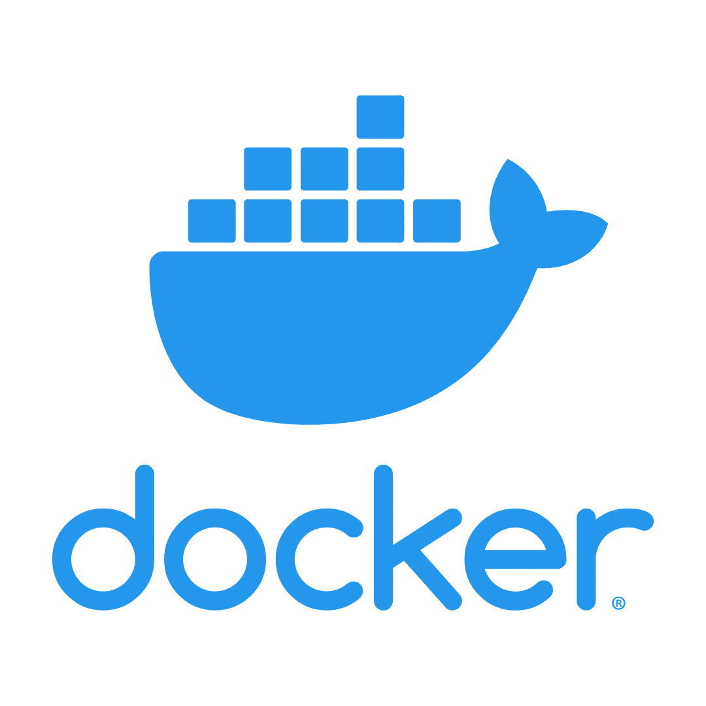
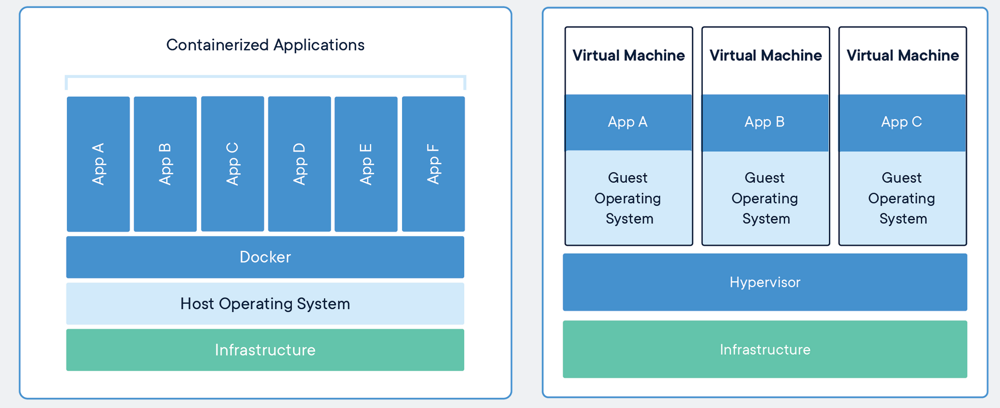

<iframe width="427" height="251" src="https://www.youtube.com/embed/Qr42pEtio-Q?list=PLKZ9c4ONm-VnqD5oN2_8tXO0Yb1H_s0sj" frameborder="0" allow="accelerometer; autoplay; encrypted-media; gyroscope; picture-in-picture" allowfullscreen></iframe>

# Documentation

The [official Docker documentation and tutorial][docker-tutorial] can be found on the
Docker website.
It is quite thorough and useful.
It is an excellent guide that should be routinely visited, but the emphasis of this
introduction is on using Docker, not how Docker itself works.

A note up front, Docker has very similar syntax to Git and Linux, so if you are familiar
with the command line tools for them then most of Docker should seem somewhat natural
(though you should still read the docs!).

It is still important to know what Docker _is_ and what the components of it _are_.
Docker images are executables that bundle together all necessary components for an
application or an environment.
[Docker containers][docker-containers] are the runtime instances of images &mdash; they
are images with a state.

Importantly, containers share the host machine's OS system kernel and so don't require an
OS per application.
As discrete processes containers take up only as much memory as necessary, making them
very lightweight and fast to spin up to run.

> ## Singularity
> Docker is the most popular containerization tool these days, particularly in industry, but it's not the only one. There are other kids on the block including Rocket and Singularity which are in use, but just haven't gained as much large-scale traction.
>
> Singularity in particular is used widely in HPC, and particularly by CMS, so you may have need to familiarize yourself with it at some point.
>
> To learn more about singularity, see for example the [HSF Training Singularity Module](https://hsf-training.github.io/hsf-training-singularity-webpage/).
{: .callout}

[docker-tutorial]: https://docs.docker.com/get-started
[docker-containers]: https://www.docker.com/resources/what-container


