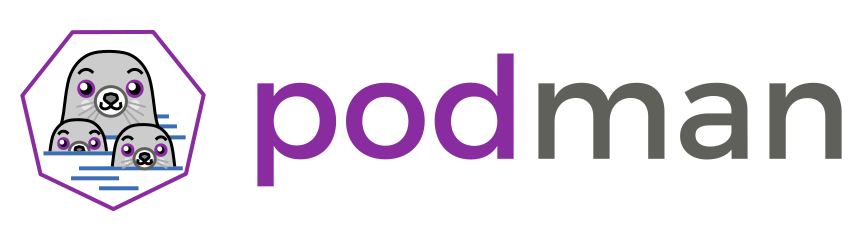

<iframe width="427" height="251" src="https://www.youtube.com/embed/Qr42pEtio-Q?list=PLKZ9c4ONm-VnqD5oN2_8tXO0Yb1H_s0sj" frameborder="0" allow="accelerometer; autoplay; encrypted-media; gyroscope; picture-in-picture" allowfullscreen></iframe>

# What is a Container?

Have you ever:
* Taken a piece of software from one computer to another and found that it doesn't work?
* Had to install a bunch of dependencies to run a piece of software written by a colleague?
* What about saying "it works on my machine" when someone else is having trouble running your code?

We often experience it, and it's a common problem in software development and data analysis.
The industry has been working on solutions to these problems for a long time,
and containers are one of the most popular solutions.

Containers are a way to package software that allows you to run an application and its dependencies in a single,
isolated unit called a container.

Importantly, containers share the host machine's OS system kernel and so don't require an
OS per application.
As discrete processes containers take up only as much memory as necessary, making them
very lightweight and fast to spin up to run:

<figure>

  <figcaption>
    <i>Container-based architecture vs virtual machines</i>
  </figcaption>
</figure>

> ## Containers on Windows and macOS
>
> Running containers in systems other than Linux, like macOS and Windows, require a virtual machine on the background to emulate the Linux kernel.
> Still, the containers are very lightweight and faster to spin up than to deploy one virtual machine for each application.
>
> Most containerization tools provide a seamless experience for the user, abstracting the virtual machine and making it transparent to the user.
> Just be aware that there is an additional layer between the containers and the host machine.
{: .callout}

# Docker

Docker is perhaps the most popular containerization tool these days, particularly in industry.
It is a platform for developing, shipping, and running applications in containers.
In addition, Docker provides a public registry for sharing and
collaborating on container images called [Docker Hub][docker-hub].

The [official Docker documentation and tutorial][docker-tutorial] can be found on the
Docker website.
It is quite thorough and useful, and an excellent guide that should be routinely visited when working with Docker.
A note up front, Docker has very similar syntax to Git and Linux, so if you are familiar
with the command line tools for them then most of Docker should seem somewhat natural
(though you should still read the docs!).

It is still important to know what Docker _is_ and what the components of it _are_.
Docker images are executables that bundle together all necessary components for an
application or an environment.
[Docker containers][docker-containers] are the runtime instances of images &mdash; they
are images with a state.

Docker is the most popular containerization tool these days, but it's not the only one.
There are other kids on the block which are in use and gaining popularity, such as Podman.

# Why Podman?

Podman is an open-source alternative to Docker with several advantages.
For example, Podman is able to run containers as a non-root user out of the box, which is a big security advantage over Docker.
The reason is Podman uses a servless architecture, which means that it doesn't require a daemon running as superuser
to execute containers as Docker does.

In addition, Docker Desktop has [licensing restrictions](https://www.docker.com/pricing/) that may prevent you
from using it in some institutions. If that is your case, Podman is an excellent alternative.

Podman is a drop-in replacement for Docker, so you can use the same commands and workflows you are used to with Docker.
Across the tutorial, we will use Podman as the containerization tool, but
**if you are interested in using Docker instead, just replace `podman` by `docker` in the commands and you should be good to go**.

> ## Apptainer
>
> Apptainer (formerly known as Singularity) is another containerization technology. In particular is used widely in HPC, and it is gaining rapid adoption on High Energy and Nuclear Physics, so you may have need to familiarize yourself with it at some point.
>
> To learn more about Apptainer, see the [HSF Training Module "Introduction to Apptainer/Singularity"](https://github.com/hsf-training/hsf-training-singularity-webpage) which includes also [more details about the difference between Apptainer and Docker](https://hsf-training.github.io/hsf-training-singularity-webpage/01-introduction/index.html).
>
{: .callout}

[docker-tutorial]: https://docs.docker.com/get-started
[docker-containers]: https://www.docker.com/resources/what-container
[docker-hub]: https://hub.docker.com


