<iframe width="427" height="251" src="https://www.youtube.com/embed/RVhbBT_pMeU?si=ns-basWygd4fKEQE" frameborder="0" allow="accelerometer; autoplay; encrypted-media; gyroscope; picture-in-picture" allowfullscreen></iframe>

# Copying

[Copying][podman-docs-cp] files between the local host and containers is possible.
On your local host, either find a file that you want to transfer to the container or create a new one. Below is the procedure
for creating a new file called io_example.txt and then copying it to the container:

~~~bash
touch io_example.txt
echo "This was written on local host" > io_example.txt
podman cp io_example.txt <NAME>:/
~~~
{: .source}

and then from the container check and modify it in some way

~~~bash
pwd
ls
cat io_example.txt
echo "This was written inside the container" >> io_example.txt
~~~
{: .source}

>## Permission issues
>If you run into a `Permission denied` error, there is a simple and quick fix to continue with the exercise:
>~~~bash
>exit  # exit container
>chmod a+w io_example.txt  # add write permissions for all users
>~~~
>{: .source}
>And continue from the ``podman cp ...`` command above.
{: .callout}

~~~
/
afs  bin  dev  etc  home  io_example.txt  lib  lib64  media  mnt  opt  proc  root  run	sbin  srv  sys	test.txt  tmp  usr  var
This was written on local host
~~~
{: .output}

and then on the local host copy the file out of the container

~~~bash
podman cp <NAME>:/io_example.txt .
~~~
{: .source}

and verify if the file has been modified as you wanted

~~~bash
cat io_example.txt
~~~
{: .source}

~~~
This was written on local host
This was written inside the container
~~~
{: .output}

# Volume mounting

What is more common and arguably more useful is to [mount volumes][podman-docs-volumes] to
containers with the `-v` flag.
This allows for direct access to the host file system inside the container and for
container processes to write directly to the host file system.

~~~bash
podman run -v <path on host>:<path in container> <image>
~~~
{: .source}

For example, to mount your current working directory (``$PWD``) on your local machine to the `data`
directory in the example container

~~~bash
podman run --rm -it -v $PWD:/data almalinux:9
~~~
{: .source}

> ## No such file or directory?
> On Windows and macOS, you may face an error while mounting the volume:
> `Error: statfs <directory>: no such file or directory`.
>
> The error occurs because the directory you are trying to mount was not shared with the virtual machine
> that runs the containers. In latest versions of Podman and Docker your home directory is shared by
> default, but with Podman you can restart the machine to ensure that the directory is mounted:
>
> ```bash
> podman machine stop
> podman machine start
> ```
> ~~~
> Starting machine "podman-machine-default"
> Waiting for VM ...
> Mounting volume... /Users:/Users
> ...
> Machine "podman-machine-default" started successfully
> ~~~
> {: .output}
{: .callout}

From inside the container you can `ls` to see the contents of your directory on your local
machine

~~~bash
cd data
ls
~~~
{: .source}

and yet you are still inside the container

~~~bash
pwd
~~~
{: .source}

~~~
/data
~~~
{: .output}

You can also see that any files created in this path in the container persist upon exit

~~~bash
touch created_inside.txt
exit
ls *.txt
~~~
{: .source}

>## Permission issues
>If you are using Linux with SELinux enabled, you might run into a `Permission denied` error.
>Note that SELinux is enabled if the output of the command `getenforce status` is `Enforcing`.
>To fix the permission issue, append `:z` (lowercase!) at the end of the mount option, like this:
>```bash
>podman run --rm -it -v $PWD:/data:z ...
>```
>If this still does not fix the issue you can disable SELinux by running `sudo setenforce 0`, or you can try using `sudo` to execute docker/podman commands, but neither of these methods is recommended.
{: .callout}

~~~
created_inside.txt
~~~
{: .output}

This I/O allows for container images to be used for specific tasks that may be difficult to
do with the tools or software installed on only the local host machine.
For example, debugging problems with software that arise on cross-platform software, or
even just having a specific version of software perform a task (e.g., using Python 2 when
    you don't want it on your machine, or using a specific release of
    [TeX Live][Tex-Live-image] when you aren't ready to update your system release).
    
    
# (Optional) Volume mounting on macOS
As previously mentioned, Podman on macOS will create a virtual machine to run containers in.

When you run a command like
~~~bash
podman run --rm -it -v $PWD:/data almalinux:9
~~~
{: .source}

the environment variable `$PWD` will be expanded on the macOS machine (the host), but the volume mounting will be performed between the virtual machine (VM) and the podman container.
This means that the path `$PWD` must already be mounted between the host and the VM for the `podman run` command to be able to link the path `$PWD` from the VM to the container.

Podman automatically mounts the host's `/Users` to the VM's `/Users`.
So, as long as the `$PWD` path is a sub-path of the host's `/Users`, is will already be mounted on the VM, and can be then mounted to the container as shown above with the `podman run` command.


If you want to mount a path on your host macOS machine not under `/Users`, you will first have to manually mount that path to the VM.
For example, let's create a file at `/private/tmp/data/datum` (`/private/tmp` is the the path that `/tmp` links to on macOS).
~~~bash
# host
mkdir /private/tmp/data
touch /private/tmp/data/datum
~~~
{: .source}

Then, we will need to recreate the VM with the `/private/tmp/data` host directory mounted to the `/data` VM directory.
~~~bash
# host
podman machine stop
podman machine rm
podman machine init -v /private/tmp/data:/data -v /Users:/Users
podman machine start
~~~
{: .source}

Note that `podman machine init -v /private/tmp/data:/data` alone would override the default `/Users:/Users` mounting done by `podman machine init`. Adding the `-v /Users:/Users` flag ensures that these paths remains mounted.

You can check that this directory is mounted properly by connecting to the VM and looking for it under `/data`
~~~bash
# host
podman machine ssh
~~~
{: .source}


~~~bash
# VM
ls /data
~~~
{: .source}


~~~
datum
~~~
{: .output}

Now (after exiting the VM to go back to the host machine), we can mount the VM `/data` directory to a container `/data` directory by running
~~~bash
# host
podman run --rm -it -v /data:/data almalinux:9
~~~
{: .source}

You can check that the file was properly mounted in the container with
~~~bash
# container
ls /data
~~~
{: .source}

~~~
datum
~~~
{: .output}


<figure>

  <figcaption>
    <i>Volume mounting from host to VM to container</i>
  </figcaption>
</figure>


    

<!--# Running Jupyter from a Docker Container-->
<!---->
<!--You can run a Jupyter server from inside of your Docker container.-->
<!--First run a container while [exposing][docker-docs-run-expose-ports] the container's-->
<!--internal port `8888` with the `-p` flag-->
<!---->
<!--~~~-->
<!--docker run --rm -it -p 8888:8888 matthewfeickert/intro-to-docker /bin/bash-->
<!--~~~-->
<!--{: .source}-->
<!---->
<!--Then [start a Jupyter server][jupyter-docs-server] with the server listening on all IPs-->
<!---->
<!--~~~-->
<!--jupyter notebook --allow-root --no-browser --ip 0.0.0.0-->
<!--~~~-->
<!--{: .source}-->
<!---->
<!--though for your convince the example container has been configured with these default-->
<!--settings so you can just run-->
<!---->
<!--~~~-->
<!--jupyter notebook-->
<!--~~~-->
<!--{: .source}-->
<!---->
<!--Finally, copy and paste the following with the generated token from the server as-->
<!--`<token>` into your web browser on your local host machine-->
<!---->
<!--~~~-->
<!--http://localhost:8888/?token=<token>-->
<!--~~~-->
<!--{: .source}-->
<!---->
<!--You now have access to Jupyter running on your Docker container.-->
<!---->
[podman-docs-cp]: https://docs.podman.io/en/latest/markdown/podman-cp.1.html
[podman-docs-volumes]: https://docs.podman.io/en/v4.4/markdown/podman-run.1.html#volume-v-source-volume-host-dir-container-dir-options
[Tex-Live-image]: https://hub.docker.com/r/matthewfeickert/latex-docker/
[docker-docs-run-expose-ports]: https://docs.docker.com/engine/reference/run/#expose-incoming-ports
[jupyter-docs-server]: https://jupyter.readthedocs.io/en/latest/running.html#starting-the-notebook-server



