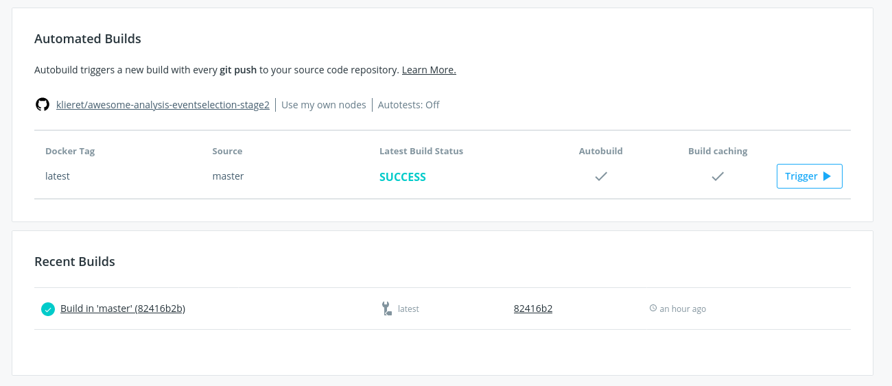

<iframe width="427" height="251" src="https://www.youtube.com/embed/YmLmWm3RNwg?list=PLKZ9c4ONm-VnqD5oN2_8tXO0Yb1H_s0sj" frameborder="0" allow="accelerometer; autoplay; encrypted-media; gyroscope; picture-in-picture" allowfullscreen></iframe>

## Introduction
In this section, we learn how to combine the forces of dockerhub and github to automatically keep your analysis environment up-to-date. 

We will be doing this using the [CMS OpenData HTauTau Analysis Payload](https://hsf-training.github.io/hsf-training-cms-analysis-webpage/). Specifically, we will be using two "snapshots" of this code which are the repositories described on the [setup page](https://hsf-training.github.io/hsf-training-docker/setup.html) of this training.  A walkthrough of how to setup those repositories can also be found [on this video](https://www.youtube.com/watch?v=krsBupoxoNI&list=PLKZ9c4ONm-VnqD5oN2_8tXO0Yb1H_s0sj&index=7). The "snapshot" repositories are available on GitHub ([skimmer repository](https://github.com/hsf-training/hsf-training-cms-analysis-snapshot) and [statistics repository](https://github.com/hsf-training/hsf-training-cms-analysis-snapshot-stats) ). If you don't already have this setup, take a detour now and watch that video and revisit the setup page.

### Writing your Dockerfile

The goal of automated environment preservation is to create a docker image that you can **immediately** start executing your analysis code inside upon startup. Let's review the needed components for this.

 * Set up the OS, system libraries, and other dependencies that your code depends on,
 * Add your analysis code to the container, and
 * Build the code so that it can just be executed trivially inside the container.

As we've seen, all these components can be encoded in a Dockerfile. So the first step to set up automated image building is to add a Dockerfile to the repo specifying these components.

> ## The `rootproject/root` docker image
> In this tutorial, we build our analysis environments on top of the `rootproject/root` base image ([link to project area on docker hub](https://hub.docker.com/r/rootproject/root)) with conda. This image comes with root 6.22 and python 3.7 pre-installed. It also comes with XrootD for downloading files from eos.
> The `rootproject/root` is itself built with a [Dockerfile](https://github.com/root-project/root-docker/blob/6.22.06-conda/conda/Dockerfile), which uses conda to install root and python on top of another base image (`continuumio/miniconda3`).
{: .callout}

> ## Exercise (15 min)
> Working from your bash shell, `cd` into the top level of the repo you use for skimming, that being the "event selection" snapshot of the CMS HTauTau analysis payload. Create an empty file named `Dockerfile`.
>
> ~~~bash
> touch Dockerfile
> ~~~
> {: .source}
>
> Now open the Dockerfile with a text editor and, starting with the following skeleton, fill in the FIXMEs to make a Dockerfile that fully specifies your analysis environment in this repo.
>
> ~~~yaml
> # Start from the rootproject/root:6.22.06-conda base image
> [FIXME]
>
> # Put the current repo (the one in which this Dockerfile resides) in the /analysis/skim directory
> # Note that this directory is created on the fly and does not need to reside in the repo already
> [FIXME]
>
> # Make /analysis/skim the default working directory (again, it will create the directory if it doesn't already exist)
> [FIXME]
>
> # Compile an executable named 'skim' from the skim.cxx source file
> RUN echo ">>> Compile skimming executable ..." &&  \
>     COMPILER=[FIXME] && \
>     FLAGS=[FIXME] && \
>     [FIXME]
> ~~~
> {: .source}
>
> > ## Solution
> > ~~~yaml
> > # Start from the rootproject/root base image with conda
> > FROM rootproject/root:6.22.06-conda
> >
> > # Put the current repo (the one in which this Dockerfile resides) in the /analysis/skim directory
> > # Note that this directory is created on the fly and does not need to reside in the repo already
> > COPY . /analysis/skim
> >
> > # Make /analysis/skim the default working directory (again, it will create the directory if it doesn't already exist)
> > WORKDIR /analysis/skim
> >
> > # Compile an executable named 'skim' from the skim.cxx source file
> > RUN echo ">>> Compile skimming executable ..." &&  \
> > COMPILER=$(root-config --cxx) &&  \
> > FLAGS=$(root-config --cflags --libs) &&  \
> > $COMPILER -g -std=c++11 -O3 -Wall -Wextra -Wpedantic -o skim skim.cxx $FLAGS
> > ~~~
> > {: .source}
> {: .solution}
>
> Once you're happy with your Dockerfile, you can commit it to your repo and push it to github.
{: .challenge}

> ## Hints
> As you're working, you can test whether the Dockerfile builds successfully using the `docker build` command. Eg.
> ~~~bash
> docker build -t payload_analysis .
> ~~~
> {: .source}
>
> When your image builds successfully, you can `run` it and poke around to make sure it's set up exactly as you want, and that you can successfully run the executable you built:
> ~~~bash
> docker run -it --rm payload_analysis /bin/bash
> ~~~
> {: .source}
{: .callout}

## Automatic image building with github + dockerhub

You can automatically build a docker image every time you push to a repository with github and
dockerhub.

1. Create a clone of the skim and the fitting repository on your private github.
  You can use the
  [GitHub Importer](https://docs.github.com/en/github/importing-your-projects-to-github/importing-a-repository-with-github-importer)
  for this. It's up to you whether you want to make this repository public or private.
2. Create a free account on [dockerhub](http://hub.docker.com/).
3. Once you confirmed your email, head to ``Settings`` > ``Linked Accounts``
   and connect your github account.
4. Go back to the home screen (click the dockerhub icon top left) and click ``Create Repository``.
5. Choose a name of your liking, then click on the  github icon in the ``Build settings``.
   Select your account name as organization and select your repository.
6. Click on the ``+`` next to ``Build rules``. The default one does fine
7. Click ``Create & Build``.

That's it! Back on the home screen your repository should appear. Click on it and select the
``Builds`` tab to watch your image getting build (it probably will take a couple of minutes
before this starts). If something goes wrong check the logs.

Once the build is completed, you can pull your image in the usual way.

~~~bash
# If you made your docker repository private, you first need to login,
# else you can skip the following line
docker login
# Now pull
docker pull <username>/<image name>:<tag>
~~~
{: .source}

> ## Tag your docker image
> Notice that the command above had a ``<tag>`` specified. A tag uniquely identifies a docker image. When puched to 

## An updated version of `skim.sh`

> ## Exercise (10 mins)
> Since we're now taking care of building the skimming executable during image building, let's make an updated version of `skim.sh` that excludes the step of building the `skim` executable.
>
> The updated script should just directly run the pre-existing `skim` executable on the input samples. You could call it eg. `skim_prebuilt.sh`. We'll be using this updated script in an exercise later on in which we'll be going through the full analysis in containers launched from the images.
>
> Once you're happy with the script, you can commit and push it to the repo.
>
> > ## Solution
> > ~~~bash
> > #!/bin/bash
> >
> > INPUT_DIR=$1
> > OUTPUT_DIR=$2
> >
> > # Sanitize input path, XRootD breaks if we double accidentally a slash
> > if [ "${INPUT_DIR: -1}" = "/" ];
> > then
> > INPUT_DIR=${INPUT_DIR::-1}
> > fi
> >
> > # Skim samples
> > while IFS=, read -r SAMPLE XSEC
> > do
> > echo ">>> Skim sample ${SAMPLE}"
> > INPUT=${INPUT_DIR}/${SAMPLE}.root
> > OUTPUT=${OUTPUT_DIR}/${SAMPLE}Skim.root
> > LUMI=11467.0 # Integrated luminosity of the unscaled dataset
> > SCALE=0.1 # Same fraction as used to down-size the analysis
> > ./skim $INPUT $OUTPUT $XSEC $LUMI $SCALE
> > done < skim.csv
> > ~~~
> > {: .source}
> {: .solution}
{: .challenge}


