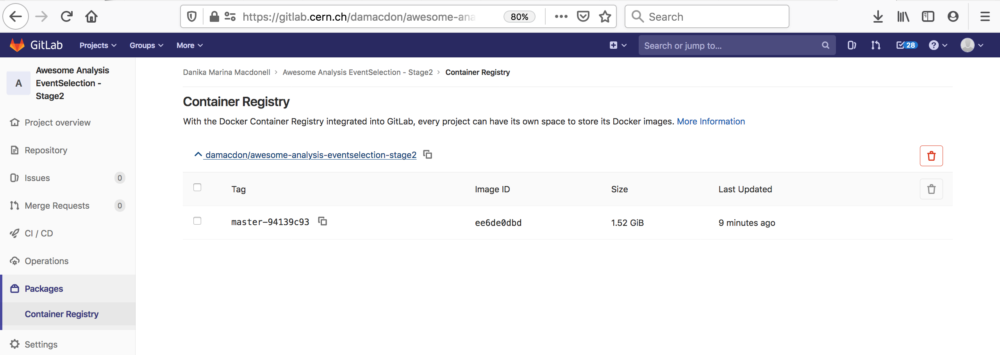

## Introduction
In this section, we learn how to combine the forces of docker and gitlab CI to automatically keep your analysis environment up-to-date. This is accomplished by adding an extra stage to the CI pipeline for each analysis repo, which builds a container image that includes all aspects of the environment needed to run the code. 

### Writing your Gitlab Dockerfile

The goal of automated environment preservation is to create a docker image that you can **immediately** start executing your analysis code inside upon startup. Let's review the needed components for this.

 * Set up the OS, system libraries, and other dependencies that your code depends on,
 * Add your analysis code to the container, and 
 * Build the code so that it can just be executed trivially inside the container.

As we've seen, all these components can be encoded in a Dockerfile. So the first step to set up automated image building is to add a Dockerfile to the repo specifying these components. 

> ## The `rootproject/root-conda` docker image
> In this tutorial, we build our analysis environments on top of the `rootproject/root-conda` base image ([link to project area on docker hub](https://hub.docker.com/r/rootproject/root-conda)). This image comes with root 6.18 and python 3.7 pre-installed. It also comes with XrootD for downloading files from eos. 
> The `rootproject/root-conda` is itself built with a [Dockerfile](https://hub.docker.com/r/rootproject/root-conda/dockerfile), which uses conda to install root and python on top of another base image (`continuumio/miniconda3`).
{: .callout} 

> ## Exercise (15 min)
> Working from your bash shell, cd into the top level of the repo you use for skimming. Create an empty file named `Dockerfile`. 
>
> ~~~bash
> touch Dockerfile
> ~~~
> {: .source}
> 
> Now open the Dockerfile with a text editor and, starting with the following skeleton, fill in the FIXMEs to make a Dockerfile that fully specifies your analysis environment in this repo. 
> 
> ~~~yaml
> # Start from the rootproject/root-conda base image
> [FIXME]
> 
> # Put the current repo (the one in which this Dockerfile resides) in the /analysis/skim directory
> # Note that this directory is created on the fly and does not need to reside in the repo already
> [FIXME] 
> 
> # Make /analysis/skim the default working directory (again, it will create the directory if it doesn't already exist)
> [FIXME]
> 
> # Compile an executable named 'skim' from the skim.cxx source file
> RUN echo ">>> Compile skimming executable ..." &&  \
>     COMPILER=[FIXME] && \
>     FLAGS=[FIXME] && \
>     [FIXME]
> ~~~
> {: .source}
>
> > ## Solution
> > ~~~yaml
> > # Start from the rootproject/root-conda base image
> > FROM rootproject/root-conda
> > 
> > # Put the current repo (the one in which this Dockerfile resides) in the /analysis/skim directory
> > # Note that this directory is created on the fly and does not need to reside in the repo already
> > COPY . /analysis/skim
> > 
> > # Make /analysis/skim the default working directory (again, it will create the directory if it doesn't already exist)
> > WORKDIR /analysis/skim
> > 
> > # Compile an executable named 'skim' from the skim.cxx source file
> > RUN echo ">>> Compile skimming executable ..." &&  \
> > COMPILER=$(root-config --cxx) &&  \
> > FLAGS=$(root-config --cflags --libs) &&  \
> > $COMPILER -g -std=c++11 -O3 -Wall -Wextra -Wpedantic -o skim skim.cxx $FLAGS
> > ~~~
> > {: .source}
> {: .solution}
> 
> Once you're happy with your Dockerfile, you can commit it to your repo and push it to github.
{: .challenge}

> ## Hints
> As you're working, you can test whether the Dockerfile builds successfully using the `docker build` command. Eg.
> ~~~bash
> docker build -t payload_analysis .
> ~~~
> {: .source}
> 
> When your image builds successfully, you can `run` it and poke around to make sure it's set up exactly as you want, and that you can successfully run the executable you built:
> ~~~bash
> docker run -it --rm payload_analysis /bin/bash
> ~~~
> {: .source}
{: .callout}

Now, you can proceed with updating your `.gitlab-ci.yml` to actually build the container during the CI/CD pipeline and store it in the gitlab registry. You can later pull it from the gitlab registry just as you would any other container, but in this case using your CERN credentials. 

Add the following lines at the end of the `.gitlab-ci.yml` file to build the image and save it to the docker registry. 

~~~yaml
build_image:
  stage: build
  variables:
    TO: $CI_REGISTRY_IMAGE:$CI_COMMIT_REF_SLUG-$CI_COMMIT_SHORT_SHA
  tags:
    - docker-image-build
  script:
    - ignore
~~~
{: .source}

<!--Now, remove the line `image: rootproject/root-conda` underneath the stages, since the image-building stage uses its own dedicated image for automated image building. You'll then need to explicitly specify that the other stages use this image by adding the line `image: rootproject/root-conda` to the stages, since it's no longer a global specification.-->

Once this is done, you can commit and push the updated `.gitlab-ci.yml` file to your gitlab repo and check to make sure the pipeline passed. If it passed, the repo image built by the pipeline should now be stored on the docker registry, and be accessible as follows:

~~~bash
docker login gitlab-registry.cern.ch
docker pull gitlab-registry.cern.ch/[repo owner's username]/[skimming repo name]:[branch name]-[shortened commit SHA]
~~~
{: .source}

You can also go to the container registry on the gitlab UI to see all the images you've built:

 

Notice that the script to run is just a dummy 'ignore' command. This is because using the docker-image-build tag, the jobs always land on special runners that are managed by CERN IT which run a custom script in the background. You can safely ignore the details.

> ## Recommended Tag Structure
> You'll notice the environment variable `TO` in the `.gitlab-ci.yml` script above. This controls the name of the Docker image that is produced in the CI step. Here, the image name will be `<reponame>:<branch or tagname>-<short commit SHA>`. The shortened 8-character commit SHA ensures that each image created from a different commit will be unique, and you can easily go back and find images from previous commits for debugging, etc. 
>
> As you'll see tomorrow, it's recommended when using your images as part of a REANA workflow to make a unique image for each gitlab commit, because REANA will only attempt to update an image that it's already pulled if it sees that there's a new tag associated with the image. 
>
> If you feel it's overkill for your specific use case to save a unique image for every commit, the `-$CI_COMMIT_SHORT_SHA` can be removed. Then the `$CI_COMMIT_REF_SLUG` will at least ensure that images built from different branches will not overwrite each other, and tagged commits will correspond to tagged images.
{: .callout} 

> ## Exercise (10 mins)
> Since we're now taking care of building the skimming executable during image building, let's make an updated version of skim.sh that excludes the step of building the `skim` executable. 
> 
> The updated script should just directly run the pre-existing `skim` executable on the input samples. You could call it eg. `skim_prebuilt.sh`. We'll be using this updated script in an exercise later on in which we'll be going through the full analysis in containers launched from the images we create with gitlab CI.
>
> Once you're happy with the script, you can commit and push it to the repo. 
> 
> > ## Solution
> > ~~~bash
> > #!/bin/bash
> > 
> > INPUT_DIR=$1
> > OUTPUT_DIR=$2
> > 
> > # Sanitize input path, XRootD breaks if we double accidentally a slash
> > if [ "${INPUT_DIR: -1}" = "/" ];
> > then
> > INPUT_DIR=${INPUT_DIR::-1}
> > fi
> > 
> > # Skim samples
> > while IFS=, read -r SAMPLE XSEC
> > do
> > echo ">>> Skim sample ${SAMPLE}"
> > INPUT=${INPUT_DIR}/${SAMPLE}.root
> > OUTPUT=${OUTPUT_DIR}/${SAMPLE}Skim.root
> > LUMI=11467.0 # Integrated luminosity of the unscaled dataset
> > SCALE=0.1 # Same fraction as used to down-size the analysis
> > ./skim $INPUT $OUTPUT $XSEC $LUMI $SCALE
> > done < skim.csv
> > ~~~
> > {: .source}
> {: .solution}
{: .challenge}



